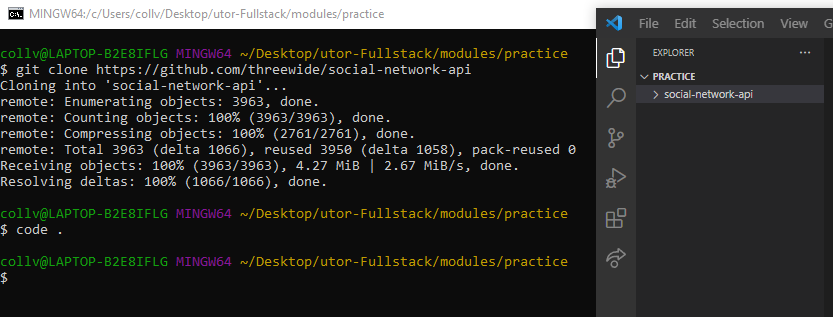
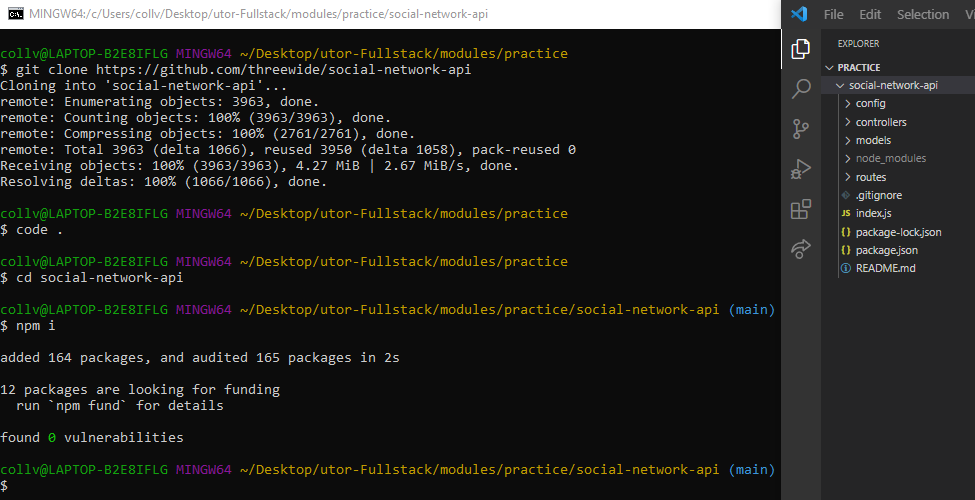

# Social-Network-API

## Description

The Social Network API is backend program for a social network that stores users, thought and reactions! The Social Network API allows users to interact with a server by using Express.js, use the CRUD methods on a mongoDB and receive the data that was modeled with Mongoose.

## Table of Contents

- [Installation](#installation)
- [Usage](#usage)
- [Credits](#credits)
- [License](#license)

## Installation
To Install and begin working on the Social Network API, follow these easy steps:

1. Open the terminal at the directory you would like to clone the project
2. In the terminal enter: '<b>git clone https://github.com/threewide/social-network-api</b>' to create a clone of the Social Network API Repo
3. In the terminal enter: '<b>code .</b>' to open the project in Visual Studios development environment

5. The project will still need to install the required node packages. In the terminal window change directory to the newly cloned Social Network API project by entering: '<b>cd social-network-api</b>' 
6. Now that you are in the correct directory, install the node packages with: '<b>npm i</b>'.

This initializes the project to a state of being both ready to be ran (with the command '<b>npm start</b>') and worked on as a developer!

## Usage

To run the application open the project folder in the terminal
Enter the command '<b>npm start</b>'

For a video demonstration: [Social Network API Demo](https://drive.google.com/file/d/1wepWDo67MYA-_29LHLal7mfC5yvmx-NB/view?usp=sharing)

## Credits

Rich Widtmann [Professional README Guide](https://coding-boot-camp.github.io/full-stack/github/professional-readme-guide) 
Course Gitlab [Instructor Demo: Git](https://utoronto.bootcampcontent.com/utoronto-bootcamp/UTOR-VIRT-FSF-FT-05-2022-U-LOLC/-/tree/main/01-HTML-Git-CSS/01-Activities/03-Ins_Git) 
Choose a License [MIT License Template](https://choosealicense.com/licenses/mit/)

## License

Copyright (c) [2022] [Justin Collver]

Permission is hereby granted, free of charge, to any person obtaining a copy
of this software and associated documentation files (the "Software"), to deal
in the Software without restriction, including without limitation the rights
to use, copy, modify, merge, publish, distribute, sublicense, and/or sell
copies of the Software, and to permit persons to whom the Software is
furnished to do so, subject to the following conditions:

The above copyright notice and this permission notice shall be included in all
copies or substantial portions of the Software.

THE SOFTWARE IS PROVIDED "AS IS", WITHOUT WARRANTY OF ANY KIND, EXPRESS OR
IMPLIED, INCLUDING BUT NOT LIMITED TO THE WARRANTIES OF MERCHANTABILITY,
FITNESS FOR A PARTICULAR PURPOSE AND NONINFRINGEMENT. IN NO EVENT SHALL THE
AUTHORS OR COPYRIGHT HOLDERS BE LIABLE FOR ANY CLAIM, DAMAGES OR OTHER
LIABILITY, WHETHER IN AN ACTION OF CONTRACT, TORT OR OTHERWISE, ARISING FROM,
OUT OF OR IN CONNECTION WITH THE SOFTWARE OR THE USE OR OTHER DEALINGS IN THE
SOFTWARE.
